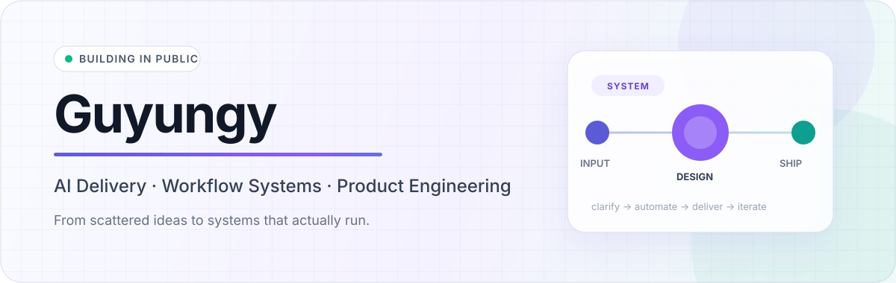
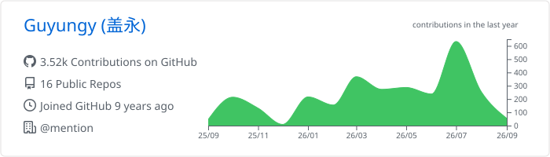
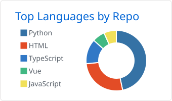
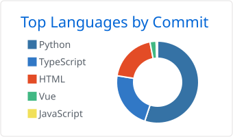

<picture>
  <source media="(prefers-color-scheme: dark)" srcset="./assets/profile-header-dark.svg">
  <source media="(prefers-color-scheme: light)" srcset="./assets/profile-header-light.svg">
  
</picture>

   
  <strong>把需求、流程与技术，变成真正进入工作流的系统。</strong>
    
  关注 AI 交付、Agent 工作流、业务自动化与轻量产品工程。
    
  <a href="#about">关于</a>
   · 
  <a href="#what-i-build">正在构建</a>
   · 
  <a href="#live-github-data">实时数据</a>
   · 
  <a href="#stack">技术栈</a>
   · 
  <a href="#working-principles">原则</a>

 

<h2 id="about">About</h2>

我是一个偏交付与落地的产品型工程师。擅长从模糊需求中梳理关键路径，把 **AI 能力、业务流程和工程实现** 组合成可运行、可验证、可持续迭代的解决方案。

我不太关注只在演示里成立的功能，更在意系统是否能进入真实工作流：边界是否清晰、失败是否可恢复、结果是否可衡量，以及后续是否有人能够继续维护。

<h2 id="what-i-build">What I build</h2>

<table>
  <tr>
    <td width="33%" valign="top">
      <strong>AI Systems</strong>  
      Agent 编排、知识库、AI 客服，以及从模型能力到业务结果的完整链路。
    </td>
    <td width="33%" valign="top">
      <strong>Delivery Engineering</strong>  
      需求澄清、方案设计、权限安全、集成验证与客户场景落地。
    </td>
    <td width="33%" valign="top">
      <strong>Internal Products</strong>  
      把重复操作沉淀为自动化流程、数据工具和可长期使用的小型 Web 产品。
    </td>
  </tr>
</table>

<h2>Current focus</h2>

> **AI-native workflow** — 让 AI 不只“能回答”，而是能够理解上下文、调用工具并完成任务闭环。
>
> **Reliable automation** — 强调权限边界、失败恢复、可观测性与长期维护。
>
> **Small, useful software** — 用最短路径验证价值，再逐步演进成稳定产品。

<h2 id="live-github-data">Live GitHub data</h2>

  <picture>
    <source media="(prefers-color-scheme: dark)" srcset="./profile-summary-card-output/github_dark/0-profile-details.svg">
    <source media="(prefers-color-scheme: light)" srcset="./profile-summary-card-output/github/0-profile-details.svg">
    
  </picture>
   
  <picture>
    <source media="(prefers-color-scheme: dark)" srcset="./profile-summary-card-output/github_dark/1-repos-per-language.svg">
    <source media="(prefers-color-scheme: light)" srcset="./profile-summary-card-output/github/1-repos-per-language.svg">
    
  </picture>
  <picture>
    <source media="(prefers-color-scheme: dark)" srcset="./profile-summary-card-output/github_dark/2-most-commit-language.svg">
    <source media="(prefers-color-scheme: light)" srcset="./profile-summary-card-output/github/2-most-commit-language.svg">
    
  </picture>
   
  <picture>
    <source media="(prefers-color-scheme: dark)" srcset="./profile-summary-card-output/github_dark/3-stats.svg">
    <source media="(prefers-color-scheme: light)" srcset="./profile-summary-card-output/github/3-stats.svg">
    
  </picture>
  <picture>
    <source media="(prefers-color-scheme: dark)" srcset="./profile-summary-card-output/github_dark/4-productive-time.svg">
    <source media="(prefers-color-scheme: light)" srcset="./profile-summary-card-output/github/4-productive-time.svg">
    
  </picture>
    
  由 GitHub Actions 每 6 小时自动刷新，也可在 Actions 页面手动更新。

<h2 id="stack">Stack</h2>

  <code>TypeScript</code>&nbsp;
  <code>React</code>&nbsp;
  <code>Next.js</code>&nbsp;
  <code>Node.js</code>&nbsp;
  <code>Python</code>&nbsp;
  <code>Docker</code>&nbsp;
  <code>Supabase</code>&nbsp;
  <code>Vercel</code>&nbsp;
  <code>Cloudflare</code>

  
<strong>我通常如何推进一个项目</strong>

   

  1. 澄清目标、边界与成功标准
  2. 设计最小可运行闭环
  3. 快速实现并用真实场景验证
  4. 补齐权限、安全、异常处理与可观测性
  5. 将有效方案沉淀为可复用能力

<h2 id="working-principles">Working principles</h2>

|  | 原则 | 行动方式 |
| :-- | :-- | :-- |
| `01` | **先闭环** | 先做最小可运行版本，而不是一次解决所有问题 |
| `02` | **再验证** | 用真实反馈修正判断，不靠想象堆功能 |
| `03` | **做系统** | 把重复劳动沉淀为流程、工具与可复用能力 |
| `04` | **持续交付** | 小步发布、保持反馈，让产品持续向前 |

 

  <strong>Build useful things. Keep shipping.</strong>
    
  Clarity over noise · Systems over demos · Outcomes over features

